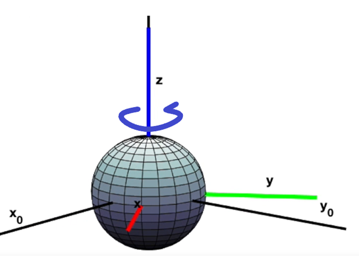
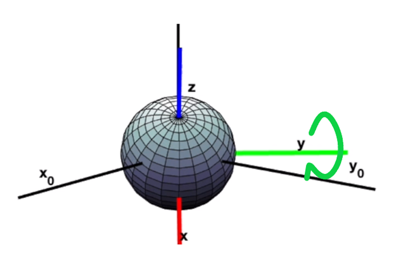
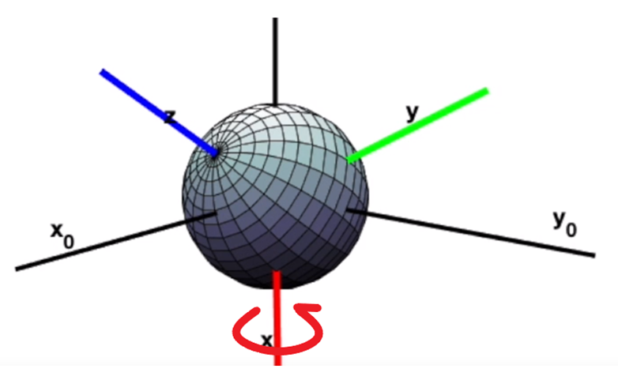
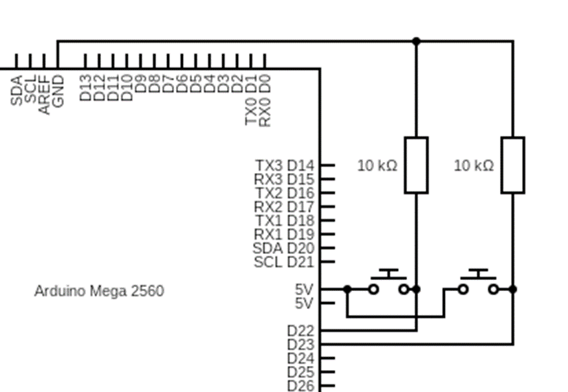

Drone control by head movements

The goal of this project is to give to anybody the possibility to have an immersive flying experience without any expensive devices.

 Detailed description :
   - The goal is to control a Tello drone using the heading of your head, and have the video stream of the Tello in a VR headset.
   - For this purpose, we will use a sensor which return some datas as quaternion to an Arduino with the I2C protocol.
   - The Arduino will then return Tait-Bryan angles (ZYX intrinsic convention) to the computer trough the serial port.(see https://en.wikipedia.org/wiki/Euler_angles if you want to understand in details) .
   - On the computer, the python code will gather the angular data from the serial port thanks to the Python library PySerial, define an initial position of the head, and then compute a tilt relative to the initial position when you will be moving the sensor.
   - The relative heading will then be used to trigger commands for the Tello, the advantage of using `send_rc_control` method from the djitellopy lib is that no feedback from the drone is expected thus the code execution is not slowed down by any wait time.
   - Always in the python code, the UDP video stream from the Tello will be piped to another UDP port
   The Node.js server will read the stream from the second port and display the video using websocket and ffmpeg.

List of everything you need :
 - Arduino Mega 2560 (large memory required by the arduino code), note that some ESP and NodeMCU could work if they have enough memory
 - Two push-up switchs (or any switch, push-ups are more convenient in this context)
 - Two 10kOhms resistors
 - Adafruit BNO085 sensor
 - smartphone and cardboard VR
 - DJI Ryze Tello drone
 - A usb wifi antenna

Steps :
1. Wire the two switchs as shown on the diagram :  - these switch will make the drone moving forward or backwards when the corresponding switch is pressed, if both switchs are pressed, nothing will happen.
2. Edit in the Arduino code `quaternion_yaw_pitch_roll.ino` the pins wired to the switchs (be aware that for a pin number written on the arduino,  its pin number in the code might not be the same, otherwise you could encounter some watchdog errors, look for any pinout for your Arduino on the net)
3. Edit the COM port in the file `main.py`
4. Run the bat file `run.bat`
5. Connect to the website (with the video stream) at `http://localhost:3000/index.html` (from your computer) or use the `ipconfig` command in a command line shell, find your IPv4 address and on any device (so your smartphone) connected to the same wifi network than your computer visit `http://<YOUR_IP_ADDRESS>:3000/index.html` put the smartphone in the carboard VR headset
6. Fix the sensor to your head by any mean possible
7. Enjoy (there is a bit of delay in the video feedback because ffmpeg is running without any optimisation, feel free to help the repo)

Huge thanks to @dbaldwin (node server) and @adafruit (arduino) for the code base <3.

